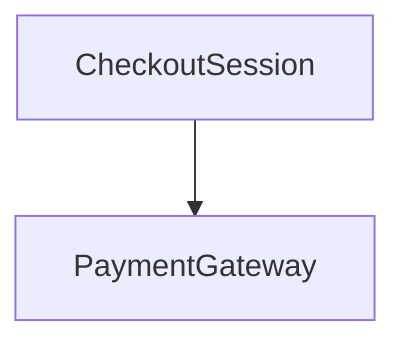

# OKF v0.2 与本仓库 Wiki：规范、agent 消费、文件名

日期：2026-08-20

## 范围与证据边界

一手来源：

- 已克隆 [`refs/knowledge-catalog`](../../refs/knowledge-catalog)，origin `https://github.com/GoogleCloudPlatform/knowledge-catalog.git`，HEAD `3fcbb9f`（`main`，与 `origin/main` 一致）。规范正文：[`okf/SPEC.md`](../../refs/knowledge-catalog/okf/SPEC.md)（OKF **v0.2**）。
- 样本 bundle：[`okf/bundles/acme_retail/`](../../refs/knowledge-catalog/okf/bundles/acme_retail/)、[`okf/README.md`](../../refs/knowledge-catalog/okf/README.md)。
- 本仓库：[`templates/`](../../templates/)、[`prompts/lead.md`](../../prompts/lead.md)、[`extensions/wiki/lib/wiki-okf.ts`](../../extensions/wiki/lib/wiki-okf.ts)、[`extensions/wiki/lib/path.ts`](../../extensions/wiki/lib/path.ts)、[`extensions/wiki/lib/citations.ts`](../../extensions/wiki/lib/citations.ts)。

Google Cloud 产品文档站点当前检索不到名为 OKF 的产品页；公开规范就是这个 GitHub 仓库里的 `okf/SPEC.md`。Open Knowledge Foundation（okfn.org）是另一个组织，无关。

事实与对本仓库的推论分开。

## 结论

1. **OKF 的入口是 `index.md`，不是 `ARCHITECTURE.md`。** 规范只保留 `index.md` 和 `log.md`（小写）。Google 样本文件名是 kebab-case 小写（`tables/orders.md`）。全大写 `ARCHITECTURE.md` / `AGENTS.md` 是**软件仓库根**的人类/agent 指针惯例（与 `README.md` 同类），不是 OKF 规则。
2. **生成 Wiki 要当 OKF bundle 给消费 agent 用。** 规范把 progressive disclosure、`description`、结构化正文、`type` 路由、`sources`+脚注当成 agent 消费面。本仓库目前只强制了「有 `type`」这一条硬符合，其余推荐字段和消费形状几乎没做。
3. **不要把 `ARCHITECTURE.md` 放进 `wiki/`。** 本仓库路径策略也禁止非 kebab 小写文件名。架构页应是 `architecture.md`，`type: Architecture`。`AGENTS.md` 留在 git 仓库根，指向 `wiki/index.md`。

## 1. OKF v0.2 实际要求什么

规范自称「minimally opinionated」：目录是 markdown + YAML frontmatter。符合性（§11）只有三条硬规则：

1. 每个非保留 `.md` 有可解析的 YAML frontmatter。
2. 每个 frontmatter 有非空 `type`。
3. 若存在 `index.md` / `log.md`，分别遵守 §8 / §9。

消费者 **MUST NOT** 因缺可选字段、未知 `type`、未知额外 key、断链、缺 `index.md` 而拒绝 bundle（§11）。

### 1.1 `type`（唯一永远必填）

`type` 是短字符串，供消费者 **routing / filtering / presentation**。规范举例是 **Title Case、带空格的描述名**（§4.1）：

`BigQuery Table`、`BigQuery Dataset`、`API Endpoint`、`Metric`、`Playbook`、`Reference`、`Attested Computation`。

没有中央注册表。生产者 SHOULD 选自解释的值；消费者 MUST 容忍未知 type。

样本 [`tables/orders.md`](../../refs/knowledge-catalog/okf/bundles/acme_retail/tables/orders.md) 写的是 `type: BigQuery Table`，不是 `type: table`。

### 1.2 推荐 frontmatter（agent 检索用）

§4.1 Recommended：

| 字段 | 用途 |
|---|---|
| `title` | 展示名；缺则可用文件名 |
| `description` | **一句话摘要**；`index.md` 生成器、搜索 snippet、preview |
| `resource` | 底层资产 URI；抽象概念可省略 |
| `tags` | 横切分类 |

可选家族（§5）：`sources`（出处）、`generated` / `verified`（信任）、`status` / `stale_after`（生命周期）。缺省有含义：无 `verified` ⇒ **unverified**；无 `status` ⇒ `stable`。

### 1.3 保留文件名：只有两个，且小写

§3.1：

| 文件 | 作用 |
|---|---|
| `index.md` | 目录 listing，progressive disclosure（§8） |
| `log.md` | 更新历史（§9） |

**没有** `ARCHITECTURE.md`、`AGENTS.md`、`README.md` 作为 OKF 保留名。其它 `.md` 全是 concept。Concept ID = 去掉 `.md` 的路径（§2）。

### 1.4 正文与链接（agent 友好的软规则）

- 正文是标准 markdown。生产者 SHOULD 偏结构化（标题、列表、表格、fence），少散文（§4.2）。
- 约定标题（适用才用）：`# Schema`、`# Examples`、`# Computation`。样本还用了 `# Notes for consumers`（`orders.md`）。
- 概念之间用标准 markdown 链接。**推荐** bundle 根相对、以 `/` 开头的绝对路径（§6.1）：`[customers](/tables/customers.md)`。相对路径也可。断链 MUST 容忍。
- 逐条出处用 markdown **脚注**，label = `sources[].id`（§5.1）。不用正文 citations 列表。设计原因：agent 常重写文档，稳定 `id` 比位置下标耐重排。

### 1.5 `generated` / `verified` 与 actor

- `generated.by`：谁写的。agent 形式 `<producer>/<version>`，例如 `reference_agent/gemini-2.5-pro`（§7）。
- `verified`：谁**对照 sources/`resource` 确认过**。可多人/多过程。信任档（§5.3）：无 verified → unverified；仅非 `human:` → machine-confirmed；有 `human:<id>` → human-reviewed。
- 写者和确认者刻意分开（§5.2）。

### 1.6 消费路径（规范自己写的）

README：「Auto-generated `index.md` files let an agent or human navigate the hierarchy **one level at a time** instead of loading the entire bundle into context。」

§8：`index.md` 枚举本目录；条目 SHOULD 带上目标 concept 的 `description`。根 `index.md` 可以有唯一允许的 frontmatter：`okf_version: "0.2"`（§12）。非根 index **无** frontmatter。

Attested Computation（§10）是「数是不是按指定算法算的」，对仓库架构 Wiki 不是第一需求。

## 2. 文件名大小写：ARCHITECTURE.md？

**规范答案：不是。**

- 保留名是 `index.md`、`log.md`，全小写（§3.1）。
- Google 样本路径全是小写 kebab：`tables/orders.md`、`computations/gross-margin-period.md`、`policies/revenue-recognition.md`。
- `type` 才是给人/agent 路由的 Title Case，不靠文件名全大写。

全大写 `README.md` / `ARCHITECTURE.md` / `AGENTS.md` / `CONTRIBUTING.md` 是 **git 仓库根** 的发现惯例：工具和人在根目录扫这些名字。`AGENTS.md` 是给 coding agent 的仓库说明书（与 Cursor/Codex 等发现 `AGENTS.md` 的惯例同类），不是 OKF concept。

两套惯例叠在 `wiki/` 里会打架：

| 放哪 | 用什么名字 | 为什么 |
|---|---|---|
| git 仓库根 | `AGENTS.md`、`ARCHITECTURE.md`（若这是软件文档） | 工具按全大写文件名发现 |
| OKF bundle（`wiki/`） | `architecture.md`，`type: Architecture` | 规范样本 + 本仓库 `isSafeWikiPagePath` 只允许 `[a-z0-9]+(-[a-z0-9]+)*` |

本仓库路径策略会直接拒绝 `wiki/ARCHITECTURE.md` 和 `wiki/AGENTS.md`（`path.ts` 的 slug 正则）。即便放开，它们在 bundle 里也只是普通 concept，仍必须有 `type`；根 `index.md` 才是消费入口。

推论：消费 agent 的启动顺序应是 `wiki/index.md` → `overview.md` / 各 source index，而不是找 `ARCHITECTURE.md`。仓库根 `AGENTS.md` 用一行指针指向 `wiki/index.md` 即可。

## 3. 对本仓库的差距

### 3.1 已对齐（硬符合性）

- 非保留页要求 YAML + 非空 `type`（`validateWikiTree`）。
- 禁止 agent 写 `index.md` / `log.md`；host 生成 `index.md`；根写入 `okf_version: "0.2"`。
- `generated.by = open-okf-wiki/1.0.0` 符合 `<producer>/<version>`。

### 3.2 差一截（agent 消费会痛）

| 点 | 规范 | 本仓库现在 |
|---|---|---|
| `type` 形态 | `Architecture`、`Playbook`、描述性 Title Case | 模板是 `arch`、`overview`、`concept`（文件名腔） |
| `description` | index / snippet 用 | 不要求；index 只用 `title` 或文件名（`wiki-okf.ts` `renderIndex`） |
| 架构页文件名 | kebab `architecture.md` | 模板文件 `arch.md` → 生成 `arch.md` |
| 出处 | `sources:` + `[^id]` 脚注 | `sources[].resource` 使用 Workspace 根相对路径和行号，正文用同 id 脚注 |
| Wiki 内链 | 推荐 `/source/domain/concept.md` | 未规定；易写成相对或源码 citation |
| `verified` | 对照证据的确认 | publish 给**每页**盖 `process:open-okf-wiki`（`stampPublication`），无独立 review 也是 machine-confirmed |
| 正文结构 | `# Schema` / `# Examples` / 表 / 列表 | 模板几乎只有一段说明 + mermaid；没有给消费 agent 的固定标题 |
| `index.md` 条目 | `* [Title](url) - description` | `- [title](./file.md)`，无 description |
| 模板 frontmatter | 生成页只留 OKF 字段 | 模板带 `scope` / `diagram` / `optional`；若 write 原样拷进 Candidate，会泄漏 host 字段（规范允许未知 key，但污染消费面） |

### 3.3 不要从规范里抄的

- **Attested Computation / executor / attester**：那是指标怎么算；仓库 Wiki 第一刀不需要。
- **type-bucket 目录**（`tables/`、`metrics/`）：样本按数据资产分桶；本仓库路径即 concept id（`<source>/<domain>/<concept>/`），与 ADR 一致。
- **强制中央 type 注册表**：规范明确非目标。

## 4. 优化方向（仍保持薄）

原则：host 继续拥有页种类（模板包）；OKF 拥有消费形状（`type`/`description`/`index`/结构标题）。不恢复 WikiSpec，不上模板引擎。

### 4.1 模板

1. **文件名** `arch.md` → `architecture.md`（zh/en 两包一起改）。生成路径变成 `…/concept/architecture.md`。
2. **`type` Title Case**：`Overview`、`Source`、`Domain`、`Concept`、`Architecture`、`Flow`、`Model`、`State Machine`、`Data Model`。filename 仍 kebab。
3. **生成页 frontmatter 最小集**：`type`、`title`、`description`（必填一句话）。`scope`/`diagram`/`optional` 只存在于模板包，host 读完丢掉，不写进 Candidate。
4. **正文用固定标题**（消费 agent 的检索锚），mermaid 放在其中一节，而不是整页唯一内容。例如 Architecture：

```markdown
---
type: Architecture
title: "{{title}}"
description: "{{description}}"
---

# 组件

# 图



# 消费注意
```

`# 消费注意` / `# Notes for consumers` 对齐样本 `orders.md`：专门写给下一个 agent 的陷阱，不写散文综述。

5. **出处**：只使用 OKF `sources` + 脚注。`resource` 写成从 Workspace 根开始的 POSIX 路径并追加 `#Lx` 或 `#Lx-Ly`；正文脚注 id 与 `sources[].id` 一致。显式 Workspace 路径包含 Source 目录，隐式 Workspace 不添加 `self/`。

### 4.2 工作流

仍是 survey → write → 可选 review → publish。改契约而不是加阶段：

- **survey**：每个 concept 交一句话 `description` + locator；optional 模板列表不变。
- **write**：按模板抄**标题结构**；填 `description`；Wiki 内链用 bundle 相对路径（`/source/domain/concept/architecture.md` 或 `./architecture.md`）；源码证据仍用现有 citation。
- **review**：对照 sources 查标识符/图/缺页。只有 `verdict: pass` 才配得上 `verified`。
- **publish**：`generated` 继续盖。`verified: process:open-okf-wiki` **不要**无 review 就盖——否则消费 agent 会把未审查页当成 machine-confirmed（§5.3）。无 review 就省略 `verified`（unverified，规范允许）。
- **index**：条目写成 `* [title](./page.md) - description`。根 index 第一句写给消费 agent：先读本页，再按需打开子目录，不要整包 ingest。

### 4.3 Prompt

Lead / write 用正向指令（不要靠一堆禁止）：

- 「这是给后续 agent 读的 OKF bundle。入口是 `wiki/index.md`。」
- 「`type` 用模板里的 Title Case；`description` 是一句话，会进 index。」
- 「正文用模板里的 `#` 标题；图放在 `# 图`；陷阱放在 `# 消费注意`。」
- 「概念之间用标准 markdown 链接；源码放进 `sources[].resource`，路径从 Workspace 根开始，正文用同 id 脚注。」

Agent SOP（`prompts/lead.md`、`agents/*.md`）保持英文；页面语言仍由 `templates/zh|en` 决定。

### 4.4 明确不做

- 不在 `wiki/` 里写 `ARCHITECTURE.md` / `AGENTS.md`。
- 不为每个 type 建 `wiki/architecture/` 桶。
- 不把 Attested Computation 塞进默认模板包。
- 不把 citation 语法一次改成纯脚注（会打断现有校验）；先补 `description`+`type`+结构标题+index snippet，出处模型第二刀。

## 5. 消费 agent 实际怎么走

```text
wiki/index.md          ← 唯一启动面（okf_version + 一句话怎么读 + 子目录 description）
  wiki/overview.md     ← type: Overview
  wiki/<source>/index.md
    source.md
    <domain>/index.md
      domain.md
      <concept>/index.md
        concept.md
        architecture.md   ← type: Architecture，不是 ARCHITECTURE.md
        flows.md
        models.md
```

一个 coding agent 进仓库：根 `AGENTS.md` 说「仓库 Wiki 在 `wiki/index.md`」。它读 index，按 description 选三页，而不是把整个 `wiki/` 塞进 context。这就是规范说的 progressive disclosure，也是把 Wiki 做成 agent 友好的最小形状。
