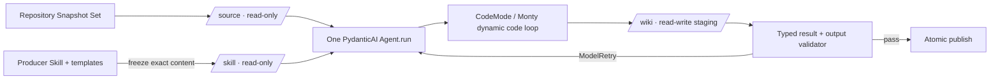

# PydanticAI greenfield：从 repo 到 wiki 的最薄 Harness 与动态 Loop

> 研究日期：2026-07-15
>
> 目标：忽略当前仓库实现，从零判断哪些能力直接交给 PydanticAI / Pydantic AI Harness，哪些语义放进产品自带的 Producer Skill。
>
> 证据范围：Pydantic 官方文章、`ai.pydantic.dev` 对应的官方文档，以及 Pydantic 官方仓库源码/API。

> 本文是 greenfield 结论，取代此前以“保留现有确定性控制平面”为前提的架构建议。

Live docs 入口包括 [Agent](https://ai.pydantic.dev/agent/)、[Output](https://ai.pydantic.dev/output/)、[Toolsets](https://ai.pydantic.dev/toolsets/)、[Message history](https://ai.pydantic.dev/message-history/)、[Multi-agent applications](https://ai.pydantic.dev/multi-agent-applications/)、[Durable execution](https://pydantic.dev/docs/ai/integrations/durable_execution/overview/) 和 [Graphs](https://ai.pydantic.dev/graph/)；下文对行为边界的引用固定到对应 release tag，避免 rolling docs 漂移。

## 结论

首版不需要 Python `Scheduler`、`Planner`、`Worker`、`Verifier`、自定义状态机或 `pydantic-graph`。最薄而完整的实现是：

1. Python 准备三个目录：目标 repo 快照 `/source`（只读）、本次精确 Skill 快照 `/skill`（只读）、输出 `/wiki`（可写）。
2. 一个 PydanticAI `Agent.run()` 执行完整任务。它本身会在模型请求和工具调用之间循环到产生最终输出；普通场景无需碰 `Agent.iter()` 或手写 `while` 调度器（[`agent.run` / `agent.iter`](https://github.com/pydantic/pydantic-ai/blob/v2.10.0/docs/agent.md#L65-L73)，[`run()` 自动遍历底层 graph](https://github.com/pydantic/pydantic-ai/blob/v2.10.0/docs/agent.md#L291-L295)）。
3. 给 Agent 一个官方 Harness `CodeMode`：模型在 Monty sandbox 里写 Python，通过循环、条件和本地聚合动态浏览 repo、读取模板、生成 wiki；三个 `MountDir` 分别控制读写权限。`CodeMode` 明确支持模型用循环、条件和 `asyncio.gather` 编排工具，并支持一个或多个 mount（[Code Mode](https://github.com/pydantic/pydantic-ai-harness/blob/v0.7.0/pydantic_ai_harness/code_mode/README.md#L1-L20)，[mount 与权限模式](https://github.com/pydantic/pydantic-ai-harness/blob/v0.7.0/pydantic_ai_harness/code_mode/README.md#L171-L234)，[多 mount 类型](https://github.com/pydantic/pydantic-ai-harness/blob/v0.7.0/pydantic_ai_harness/code_mode/_toolset.py#L53-L59)）。
4. Producer Skill 用 `SKILL.md` 描述语义工作法，模板放在 `/skill/templates/`，由 Agent 按需读取。Python 不解释模板、不硬编码页面生成阶段。
5. Agent 直接把 Markdown 写到 staging `/wiki`，最终只返回一个小型 Pydantic typed result；Python output validator 检查输出路径和最低机械完整性，通过后原子发布。PydanticAI 已提供结构化输出、Pydantic validation、异步 output validator 和 `ModelRetry` 自纠正（[structured output](https://github.com/pydantic/pydantic-ai/blob/v2.10.0/docs/output.md#L34-L43)，[output validators](https://github.com/pydantic/pydantic-ai/blob/v2.10.0/docs/output.md#L567-L611)）。

因此真正消除“流程写死”的方式，不是先造一个动态 workflow engine，而是把**语义决策规则放入 Skill，把受信任 I/O 边界和最终机械校验留在 Python，再让 `Agent.run()` + `CodeMode` 执行动态 loop**。

## 证据基线与稳定性

- 本项目已按评估基线精确锁定 PydanticAI [`v2.10.0`](https://github.com/pydantic/pydantic-ai/releases/tag/v2.10.0)；tag 内包元数据标记 `Production/Stable`（[`pyproject.toml`](https://github.com/pydantic/pydantic-ai/blob/v2.10.0/pyproject.toml#L13-L48)）。V2 minor release 原则上不故意破坏兼容，但 message/event variant 和可选字段等不在保证内（[version policy](https://github.com/pydantic/pydantic-ai/blob/v2.10.0/docs/version-policy.md)）。
- 本项目也精确锁定 Pydantic AI Harness [`v0.7.0`](https://github.com/pydantic/pydantic-ai-harness/tree/v0.7.0)。它是官方 capability library，但仍是 `0.x` / Alpha；minor release 可以 breaking（[官方定位](https://github.com/pydantic/pydantic-ai-harness/blob/v0.7.0/README.md#L8-L16)，[Alpha classifier](https://github.com/pydantic/pydantic-ai-harness/blob/v0.7.0/pyproject.toml#L17-L32)，[version policy](https://github.com/pydantic/pydantic-ai-harness/blob/v0.7.0/README.md#L326-L335)），因此升级需要重新跑契约与端到端评估，而不是复制其内部实现。
- 官方文章 [When agents build agents](https://pydantic.dev/articles/when-agents-build-agents) 把相关能力统称为 experimental。文章示例仍从 `experimental.*` import，但 `v0.7.0` 中这些位置已经是发出 `DeprecationWarning` 的兼容 shim，应使用 `pydantic_ai_harness.dynamic_workflow`、`.subagents`、`.step_persistence` 和 `.runtime_authoring`（例如 [`DynamicWorkflow` shim](https://github.com/pydantic/pydantic-ai-harness/blob/v0.7.0/pydantic_ai_harness/experimental/dynamic_workflow/__init__.py#L1-L15)）。“experimental”仍准确描述稳定性，不再是推荐 import path。

## 两个 refs 的真实实现边界

### Open Knowledge：workflow 是指南，不是 engine

Open Knowledge 的 `workflow` MCP tool 明确声明自己“返回 instructional text，不返回 data”，`kind: "wiki"` 分支只解析项目目录并返回 `buildWikiBody(...)` 的文本，没有执行 survey、排程或页面生成（[`workflow.ts`](https://github.com/inkeep/open-knowledge/blob/96563d1ea9b51b5854c5651a7091d8f96512f4cd/packages/server/src/mcp/tools/workflow.ts#L1-L18)、[`workflow.ts`](https://github.com/inkeep/open-knowledge/blob/96563d1ea9b51b5854c5651a7091d8f96512f4cd/packages/server/src/mcp/tools/workflow.ts#L124-L133)）。真正的 generate / refresh 决策、阶段、STOP gate、拆页、写页和 link audit 都在给宿主 coding agent 阅读的指南中（[`wiki-body.ts`](https://github.com/inkeep/open-knowledge/blob/96563d1ea9b51b5854c5651a7091d8f96512f4cd/packages/server/src/mcp/tools/wiki-body.ts#L58-L142)）。

它的 Codebase Wiki Skill 持有 Wiki 形状、audience/depth、来源引用、freshness、日志纪律和模板使用规则（[`SKILL.md`](https://github.com/inkeep/open-knowledge/blob/96563d1ea9b51b5854c5651a7091d8f96512f4cd/packages/server/assets/skills/packs/codebase-wiki/SKILL.md#L17-L84)）；模板本身只是 frontmatter 与标题骨架（[`starter.ts`](https://github.com/inkeep/open-knowledge/blob/96563d1ea9b51b5854c5651a7091d8f96512f4cd/packages/server/src/seed/starter.ts#L519-L704)）。源码注释直接说明该 recipe 只组合已发布工具，“no new engine code”（[`wiki-body.ts`](https://github.com/inkeep/open-knowledge/blob/96563d1ea9b51b5854c5651a7091d8f96512f4cd/packages/server/src/mcp/tools/wiki-body.ts#L15-L17)）。

### OpenWiki：宿主只启动一次 DeepAgent loop

OpenWiki 的生成入口准备 provider、Git 上下文和输出快照后，只构造一次 `createDeepAgent(...)`，再调用一次 `agent.streamEvents(...)`；文件探索、搜索、subagent、拆页、写入顺序和停止均发生在 DeepAgents 自己的 loop 中（[`index.ts`](https://github.com/langchain-ai/openwiki/blob/ddd1f609b23d83b96a800ea0f4d47e7d28a78c7d/src/agent/index.ts#L149-L231)）。生成规则集中在 system prompt，包括只读 subagent、临时计划、页面质量、增量更新和完成自检（[`prompt.ts`](https://github.com/langchain-ai/openwiki/blob/ddd1f609b23d83b96a800ea0f4d47e7d28a78c7d/src/agent/prompt.ts#L78-L94)、[`prompt.ts`](https://github.com/langchain-ai/openwiki/blob/ddd1f609b23d83b96a800ea0f4d47e7d28a78c7d/src/agent/prompt.ts#L185-L221)）。模型直接写 Markdown，宿主 backend 只强制 init/update 的写路径位于 `/openwiki`（[`docs-only-backend.ts`](https://github.com/langchain-ai/openwiki/blob/ddd1f609b23d83b96a800ea0f4d47e7d28a78c7d/src/agent/docs-only-backend.ts#L25-L70)）。

OpenWiki 没有 page renderer、Claim database 或独立 workflow engine。它的不足也正好指出 greenfield 应补的最小代码：生成时使用 staging、把 shell/filesystem 边界做成真实权限，并在成功游标前执行最终 validator；不需要因此增加一套 Scheduler。

### 合并后的最小答案

最值得组合的是：**Open Knowledge 的版本化 Skill + templates，OpenWiki 的单 Agent 直接写 Wiki，以及 PydanticAI 官方 Harness 的 sandbox、loop、limit 和 validation 原语。** Python 只保留可执行边界，语义流程留在 Skill。

## 动态能力分四层，不要混成一个引擎

| 层次 | 官方原语 | 它动态决定什么 | repo → wiki 建议 |
|---|---|---|---|
| 模型—工具 loop | `Agent.run()` | 下一次调用哪个工具、何时继续或结束 | **首版默认**。无需自建 scheduler。 |
| 工具级程序 | Harness `CodeMode` | 模型写循环、条件、批量读取、过滤、聚合和写文件的 sandbox Python | **首版默认**。这是 repo 调查和 wiki 生成最贴切的 dynamic workflow。 |
| Agent 级委派 | Harness `SubAgents` / `DynamicWorkflow` | 委派给哪个 specialist；后者让模型写子 agent 的 fan-out / chain / vote 脚本 | 只有单 Agent benchmark 不够时再加。 |
| 跨进程与时间 | Temporal / DBOS / Prefect / Restate | crash/restart、长时间等待、外部事件后的恢复 | 只有运行确实需要 durable execution 时再选现成集成。 |

官方文章也明确区分：harness 让**一次 run**可靠；loop of agents 才选择自己的结构并跨越一次 run 的寿命（[When agents build agents](https://pydantic.dev/articles/when-agents-build-agents)）。对一次性的 repo→wiki 生成，先证明“一次 run 不够”，再引入外层 loop。

## Python 与 Producer Skill 的边界

| 放在 Python Harness | 放在 Producer Skill / templates |
|---|---|
| 选择模型/provider，注入凭据 | Wiki 的目的、读者和写作原则 |
| 构造 source/skill/wiki mounts 及只读/可写权限 | 如何调查一个陌生 repo、先看什么、何时深入 |
| 固定本次 Skill 版本/内容 digest | 如何决定页面、章节、拆分、合并和交叉链接 |
| `Agent.run()`、`UsageLimits`、retry、concurrency | 页面模板、frontmatter 示例、图表约定和文风 |
| 小型 typed final result | 证据引用规则、哪些断言需要回到源码确认 |
| 路径穿越、输出目录、文件存在、manifest shape 等机械校验 | 自检清单、何时重读页面、何时认为 wiki 已完成 |
| staging → published 的原子切换 | 遇到缺失信息或重大歧义时何时向用户提问 |
| message history / durable backend（仅按需） | 若启用子 agent：何时委派、希望 specialist 返回什么 |

这个边界意味着：

- Python 不拥有 repo 的语义分类、固定分析阶段或页面生产顺序。
- Skill 不持有凭据、任意宿主代码、真实路径权限、预算或发布权限。
- 模板是 Skill 的资料，不需要 Python template engine。Agent 读取模板并直接写 Markdown。
- 目标 repo 自己的 `AGENTS.md`、`CLAUDE.md`、`.agents/skills/` 不是 Producer Skill，默认不自动加载。若以后使用 Harness `SubAgents`，必须显式指定产品 Skill 的 agent 目录或设置 `agent_folders=None`，因为其默认行为会扫描当前 repo 和 home 下的 agent 定义（[`SubAgents` disk loading](https://github.com/pydantic/pydantic-ai-harness/blob/v0.7.0/pydantic_ai_harness/subagents/README.md#L107-L125)）。

建议的 Skill bundle 保持简单：

```text
producer-skill/
  SKILL.md
  references/
    generate.md
    refresh.md
    review.md
  templates/
    overview.md
    architecture.md
    module.md
    flow.md
    concept.md
```

`SKILL.md` 只放每次都需要的主步骤、分支入口和可检查的完成条件；generate/refresh/review 的细节按分支放入 references；templates 只提供结构，章节语义只在一处定义。专用 Producer 每次必然使用这个 Skill，因此无需再造自动触发 catalog 或动态 Skill registry。首版也不需要 Skill scripts；若未来加入 specialist，受信任的 agent 定义可作为同一 bundle 的可选资产，由 Harness 显式加载。

PydanticAI V2 的 `Capability` 已经能把 instructions、tools、hooks 和 model settings 组合起来，并支持按需加载；它是官方的“skills-style progressive disclosure”原语（[capabilities](https://github.com/pydantic/pydantic-ai/blob/v2.10.0/docs/capabilities.md#L1-L16)，[on-demand capability](https://github.com/pydantic/pydantic-ai/blob/v2.10.0/docs/capabilities.md#L18-L68)）。但 repo→wiki 每次都需要 Producer Skill，因此首版只需一条 bootstrap instruction 让 Agent 先读 `/skill/SKILL.md`。不要为一个必用 Skill 再造 registry、loader 或 deferred-capability adapter。

## PydanticAI 核心能力逐项核对

### `Agent.run()` 与 `Agent.iter()`

`Agent.run()` 已经跑完整的 agent graph；`Agent.iter()` 是同一个 graph 的低层观察/操控入口，可 async iterate 或逐 node `next()`（[`Agent.iter`](https://github.com/pydantic/pydantic-ai/blob/v2.10.0/docs/agent.md#L291-L361)）。因此：

- 正常生成使用 `run()`。
- 只有需要把 webhook/外部事件注入正在执行的 run、逐节点调试或特殊 streaming 时才用 `iter()`。
- `iter()` 不是“动态业务 workflow”；把它包成 scheduler 反而重新把流程写回 Python。

PydanticAI 还支持用 `RunContext.enqueue` / `AgentRun.enqueue` 在 run 中注入 `'asap'` 或 `'when_idle'` 消息，并提醒必须用 `UsageLimits` 防止重定向无限循环（[mid-run enqueue](https://github.com/pydantic/pydantic-ai/blob/v2.10.0/docs/message-history.md#L497-L600)）。这已经覆盖大多数“运行中 steer”需求。

### Typed outputs 与 output validators

`output_type` 支持 Pydantic model、dataclass、TypedDict、union 等，并由 Pydantic 生成 schema 和验证 model output（[output types](https://github.com/pydantic/pydantic-ai/blob/v2.10.0/docs/output.md#L34-L43)）。Output validator 可以异步访问 deps，做 I/O 校验，并通过 `ModelRetry` 把错误反馈给模型重做（[validator API](https://github.com/pydantic/pydantic-ai/blob/v2.10.0/docs/output.md#L567-L611)）。

这里应只让 typed result 表达一次 run 的终态，例如：

```python
class Complete(BaseModel):
    status: Literal['complete']
    pages: list[str]


class NeedsInput(BaseModel):
    status: Literal['needs_input']
    questions: list[str]
```

页面正文不应塞进一个巨大 final output；Agent 应在 loop 中逐步写入 `/wiki`，typed result 只列出产物。这样模板可动态调整，也不会把整站内容强迫进一次 output-tool payload。

PydanticAI `AgentSpec` 可以用 YAML/JSON 声明 model、instructions 和 capabilities（[Agent Specs](https://github.com/pydantic/pydantic-ai/blob/v2.10.0/docs/agent-spec.md#L1-L38)），但其 `output_schema` 只指导模型，返回值不会按 `properties` / `required` 做运行时验证（[限制](https://github.com/pydantic/pydantic-ai/blob/v2.10.0/docs/agent-spec.md#L143-L148)）。因此 Agent 配置可声明化，最终 publication contract 仍应使用 Python `output_type`。

### Tools、toolsets、deps 与 capabilities

- deps 是普通 Python 类型，通过 `RunContext.deps` 给 tools、instructions 和 validators 使用（[dependencies](https://github.com/pydantic/pydantic-ai/blob/v2.10.0/docs/dependencies.md#L1-L54)）。这里适合放 job id、staging paths、发布器和非 prompt secrets。
- Toolsets 可以在 Agent 构造、单次 run、每次 step 或 override context 动态提供（[toolset entry points](https://github.com/pydantic/pydantic-ai/blob/v2.10.0/docs/toolsets.md#L2-L13)），并已有 combine、filter、approval 和 deferred loading（[composition/filter](https://github.com/pydantic/pydantic-ai/blob/v2.10.0/docs/toolsets.md#L245-L276)，[approval/deferred loading](https://github.com/pydantic/pydantic-ai/blob/v2.10.0/docs/toolsets.md#L454-L519)）。
- Capabilities 已把 tools、hooks、instructions、model settings 合成一个扩展点；不需要项目再定义平行的 runner 插件协议。

repo→wiki 首版甚至不需要自定义 toolset：`CodeMode` 的只读/读写 mounts 已能让 sandboxed `pathlib` 调查并写文件。若后续需要逐行分页、regex 搜索上限、content hash 和 optimistic concurrency，可换用官方 Harness `FileSystem`，它已经提供这些工具和 path/symlink containment（[`FileSystem` tools](https://github.com/pydantic/pydantic-ai-harness/blob/v0.7.0/pydantic_ai_harness/filesystem/README.md#L14-L57)）。不要再实现一套 repo reader。

### Message history 与 context management

PydanticAI result 已提供 `all_messages()` / `new_messages()` 及 JSON 版本，历史可通过 `message_history=` 继续下一次 run（[message APIs](https://github.com/pydantic/pydantic-ai/blob/v2.10.0/docs/message-history.md#L1-L18)，[reuse](https://github.com/pydantic/pydantic-ai/blob/v2.10.0/docs/message-history.md#L145-L175)）。`ModelMessagesTypeAdapter` 是官方序列化入口；V2 还会在下一次请求前修复中断造成的 tool-call / tool-result 不配对（[provider-valid repair](https://github.com/pydantic/pydantic-ai/blob/v2.10.0/docs/message-history.md#L227-L242)）。

首版单次 run 不需要业务 session store。只有以下情况才持久化 history：

- Agent 返回 `needs_input`，用户回答后继续；
- 任务被外部事件暂停；
- 实测 context window 不足，需要跨 run 延续。

长 context 不要自建压缩器。核心已有 `ProcessHistory` hook；官方 Harness 还提供 `SlidingWindow`、`DeduplicateFileReads`、`ClearToolResults`、`SummarizingCompaction` 和 `TieredCompaction`（[compaction menu](https://github.com/pydantic/pydantic-ai-harness/blob/v0.7.0/pydantic_ai_harness/compaction/README.md#L22-L39)）。只有 trace 显示 context 成为实际瓶颈后再启用。

### Usage limits、retries 与 concurrency

PydanticAI 已有：

- `UsageLimits`：request、input/output/total tokens 和 tool calls；`request_limit` 可截断无限 tool loop，parallel tool batch 若会越过 `tool_calls_limit` 会整批不执行（[limits](https://github.com/pydantic/pydantic-ai/blob/v2.10.0/docs/agent.md#L582-L683)）。
- 工具参数、structured output validation 和显式 `ModelRetry` 的自纠正；tool 与 output 有独立 retry budget（[reflection/retries](https://github.com/pydantic/pydantic-ai/blob/v2.10.0/docs/agent.md#L1084-L1102)）。
- `max_concurrency` / `ConcurrencyLimit(max_running, max_queued)` 为 concurrent runs 提供 backpressure（[concurrency](https://github.com/pydantic/pydantic-ai/blob/v2.10.0/docs/agent.md#L799-L831)）。

因此 Python 只需配置这些现成参数，并在 `Agent.run()` 外施加一次总 wall-clock deadline。不要实现 token counter、retry state machine 或 worker semaphore；这个 host-enforced deadline 是运行边界，不是新的业务 workflow engine。

### Multi-agent 与 delegation

核心文档把复杂度明确排成：single agent → agent delegation → programmatic hand-off → graph → deep agents，并展示在 parent tool 中调用 child `Agent.run(..., usage=ctx.usage)`（[multi-agent levels and delegation](https://github.com/pydantic/pydantic-ai/blob/v2.10.0/docs/multi-agent-applications.md#L1-L23)）。官方 Harness 进一步提供：

- `SubAgents`：一个 `delegate_task(agent_name, task)` 工具；child history 隔离，默认转发 deps/usage，可设置每 delegate 的 usage、wall-clock timeout、最大调用数和 error containment（[`SubAgents`](https://github.com/pydantic/pydantic-ai-harness/blob/v0.7.0/pydantic_ai_harness/subagents/README.md#L16-L58)，[per-delegate controls](https://github.com/pydantic/pydantic-ai-harness/blob/v0.7.0/pydantic_ai_harness/subagents/README.md#L60-L101)）。
- `DynamicWorkflow`：模型写 Monty Python，把 named agents 当 async functions，支持 fan-out、chain、vote 和 loop；只有脚本末值回到 parent context（[`DynamicWorkflow` model](https://github.com/pydantic/pydantic-ai-harness/blob/v0.7.0/pydantic_ai_harness/dynamic_workflow/README.md#L18-L35)，[typed child output](https://github.com/pydantic/pydantic-ai-harness/blob/v0.7.0/pydantic_ai_harness/dynamic_workflow/README.md#L129-L169)）。

官方自己的建议是“不确定时先用 `SubAgents`”，只有协调本身成为主要工作才用 `DynamicWorkflow`（[选择边界](https://github.com/pydantic/pydantic-ai-harness/blob/v0.7.0/pydantic_ai_harness/dynamic_workflow/README.md#L52-L66)）。这与 greenfield 最小方案一致：先单 Agent；确有独立、重复、可并行的 repo 分区后，先加 `SubAgents`，再 benchmark `DynamicWorkflow`。

### Durable execution 与 `pydantic-graph`

PydanticAI 官方支持 Temporal、DBOS、Prefect、Restate 四种 durable execution 方案，它们用于 API failure、应用 crash/restart、长任务和 human-in-the-loop（[overview](https://github.com/pydantic/pydantic-ai/blob/v2.10.0/docs/durable_execution/overview.md#L1-L17)）。例如 Temporal 会把 model request、I/O tool 和 MCP 变成 activities，把 agent run loop 留在 deterministic workflow 中（[Temporal model](https://github.com/pydantic/pydantic-ai/blob/v2.10.0/docs/durable_execution/temporal.md#L7-L29)，[`TemporalAgent`](https://github.com/pydantic/pydantic-ai/blob/v2.10.0/docs/durable_execution/temporal.md#L67-L71)）。需要 durability 时应选其中之一，不要自建 checkpoint scheduler。

`pydantic-graph` 是代码定义的 finite state machine，官方文档自己警告它设置成本高、通常并非必要（[graph warning](https://github.com/pydantic/pydantic-ai/blob/v2.10.0/docs/graph.md#L1-L21)）。更关键的是，V2 已移除 `pydantic_graph.persistence`，没有对应的 graph-state persistence（[V2 changelog](https://github.com/pydantic/pydantic-ai/blob/v2.10.0/docs/changelog.md#L112-L120)）。它既不提供 model-chosen workflow，也不提供当前所需的 durability，因此不应成为首版 repo→wiki backbone。

## `When agents build agents` 四项能力的准确边界

### SubAgents

它解决“parent 如何安全、有限地调用 named child”，不是动态生成任意 agent。每次 delegation 是独立 `Agent.run`，child 看不到 parent history；可以形成树，但 roster、共享 capabilities 和权限仍由宿主提供。对 repo→wiki，它适合按模块做只读调查或独立 reviewer，不必用来复制固定 Planner/Worker/Verifier 三段式。

### DynamicWorkflow

它是**一个 `run_workflow` tool 内的 model-authored sub-agent choreography**，不是 durable business workflow：

- `max_agent_calls` 是 exact host-enforced child-run ceiling；token limit 在 concurrent fan-out 下可能只是 best effort（[budgets](https://github.com/pydantic/pydantic-ai-harness/blob/v0.7.0/pydantic_ai_harness/dynamic_workflow/README.md#L309-L349)）。
- Monty resource duration 只计算 sandbox bytecode 执行时间，不计算等待 child 的 wall time（[resource limit](https://github.com/pydantic/pydantic-ai-harness/blob/v0.7.0/pydantic_ai_harness/dynamic_workflow/README.md#L351-L379)）。
- Workflow 不能嵌套；child 是 leaf（[no nesting](https://github.com/pydantic/pydantic-ai-harness/blob/v0.7.0/pydantic_ai_harness/dynamic_workflow/README.md#L381-L389)）。
- 当前 child input 只有 `task: str`；structured inputs、durable workflow snapshot 和 progress streaming 仍是 planned，不是 shipped（[what is coming](https://github.com/pydantic/pydantic-ai-harness/blob/v0.7.0/pydantic_ai_harness/dynamic_workflow/README.md#L486-L494)）。
- child error 不能在脚本内 catch，会 abort script 并让 model retry（[error boundary](https://github.com/pydantic/pydantic-ai-harness/blob/v0.7.0/pydantic_ai_harness/dynamic_workflow/README.md#L461-L484)）。
- `reveal()` 只能 append 新 agent，不能移除，且共享同一 capability instance 时影响所有 in-flight runs（[reveal](https://github.com/pydantic/pydantic-ai-harness/blob/v0.7.0/pydantic_ai_harness/dynamic_workflow/README.md#L414-L441)）。

所以它可作为“大 repo 的并行调查/评审加速器”，不能代替发布事务、持久化或安全边界。首个合理 spike 是：只读 `module_researcher` 并行返回 typed page notes，parent Agent 仍负责写 `/wiki` 和收尾。

### StepPersistence

`StepPersistence` 提供 append-only step events、provider-valid message snapshots、tool-effect ledger 和 run lineage；它明确不是 full graph-state checkpoint，不能恢复 capability state、workspace snapshot 或 graph node（[scope](https://github.com/pydantic/pydantic-ai-harness/blob/v0.7.0/pydantic_ai_harness/step_persistence/README.md#L14-L42)）。它的 `continue_run` 本质仍是取消息再传回 `Agent.run(message_history=...)`（[continue](https://github.com/pydantic/pydantic-ai-harness/blob/v0.7.0/pydantic_ai_harness/step_persistence/README.md#L117-L157)）。Crash 后处于 `started`、无 terminal record 的 side effect 只能标成 unknown，去重仍由 orchestrator 负责（[failure recovery](https://github.com/pydantic/pydantic-ai-harness/blob/v0.7.0/pydantic_ai_harness/step_persistence/README.md#L232-L256)）。

因此首版不需要它。只有“单次 run 很贵、确实频繁在中途失败，且需要 forensic trail / safe-boundary continuation”时再加；若要求生产级跨进程 exactly-once/长等待，直接用 durable execution integration。

### RuntimeAuthoring

`RuntimeAuthoring` 让 model 写真实 `.py` capability，宿主 import 并做有限验证；新 capability 只能在**下一次** `agent.run` 生效，不会在当前 turn 或当前 run 动态出现（[activation boundary](https://github.com/pydantic/pydantic-ai-harness/blob/v0.7.0/pydantic_ai_harness/runtime_authoring/README.md#L55-L70)）。官方 README 明确说明 authored code 会在宿主进程 import、构造和运行，是任意 Python trust boundary（[trust boundary](https://github.com/pydantic/pydantic-ai-harness/blob/v0.7.0/pydantic_ai_harness/runtime_authoring/README.md#L101-L119)）。

Producer Skill 的可编辑版本和模板只是受信任的 Markdown/data，不需要 RuntimeAuthoring。repo→wiki 不应让 model 自己给宿主增加代码能力。

## 推荐的 greenfield 运行形态



最小代码形态如下；这是接口草图，不是要求再造 framework：

```python
from dataclasses import dataclass
from pathlib import Path
from typing import Literal

from pydantic import BaseModel
from pydantic_ai import Agent, ModelRetry, RunContext, UsageLimits
from pydantic_ai_harness import CodeMode
from pydantic_monty import MountDir


class Complete(BaseModel):
    status: Literal['complete']
    pages: list[str]


class NeedsInput(BaseModel):
    status: Literal['needs_input']
    questions: list[str]


Result = Complete | NeedsInput


@dataclass
class Deps:
    wiki_dir: Path


def build_agent(model: str, source: Path, skill: Path, wiki: Path) -> Agent[Deps, Result]:
    agent = Agent[Deps, Result](
        model,
        deps_type=Deps,
        output_type=Result,  # type: ignore[arg-type]
        instructions=(
            'Generate a wiki for /source. Read /skill/SKILL.md first and follow it. '
            'Read templates from /skill only when needed. Write final artifacts only under /wiki.'
        ),
        capabilities=[
            CodeMode(
                mount=[
                    MountDir('/source', source, mode='read-only'),
                    MountDir('/skill', skill, mode='read-only'),
                    MountDir('/wiki', wiki, mode='read-write'),
                ]
            )
        ],
        retries={'tools': 2, 'output': 2},
    )

    @agent.output_validator
    def validate_result(ctx: RunContext[Deps], result: Result) -> Result:
        if isinstance(result, Complete):
            root = ctx.deps.wiki_dir.resolve()
            invalid = []
            for page in result.pages:
                path = (root / page).resolve()
                if not path.is_relative_to(root) or not path.is_file():
                    invalid.append(page)
            if invalid:
                raise ModelRetry(f'Wiki pages are missing or outside the staging root: {invalid}')
        return result

    return agent


result = await build_agent(model, source_dir, skill_dir, staging_wiki).run(
    'Inspect the repository and produce the best wiki allowed by the Producer Skill.',
    deps=Deps(wiki_dir=staging_wiki),
    usage_limits=UsageLimits(
        request_limit=40,
        total_tokens_limit=200_000,
        tool_calls_limit=30,
    ),
)
```

这里没有 page scheduler。Agent 何时 inventory、何时深入模块、生成哪些页面、是否重写、如何 review，全部由 Skill 和运行时发现决定。Python 建立只读/可写边界，核对 manifest、frontmatter、内部链接、Source Citations、路径与配额，并在校验后原子发布；这些是 trust-boundary validation 和 publication，不是 semantic workflow。

## 最小演进梯子

1. **一个 `Agent.run` + `CodeMode` mounts + Producer Skill。** 先用真实 repos 和 evals 测 wiki usefulness、事实错误、遗漏、成本和时延。
2. **若长 run 漂移，先加官方 `Planning()`；若 context 过大，加 Harness compaction。** 不写 planner/context engine（[`Planning`](https://github.com/pydantic/pydantic-ai-harness/blob/v0.7.0/pydantic_ai_harness/planning/README.md#L12-L47)）。
3. **若偶发 specialist 有收益，加 `SubAgents`。** Agent definitions 可放在产品 Skill 的受信任目录并显式加载；不要扫描 target repo。
4. **若大量独立分区和多轮 critic coordination 成为主要成本，再试 `DynamicWorkflow`。** 必须设置 `max_agent_calls` 和 `sub_agent_usage_limits`，并接受当前 `task: str` / non-durable 边界。
5. **若任务确需 crash-resume、外部事件或人工长等待，接官方 durable execution。** 不用 StepPersistence 冒充 durable workflow。
6. **永不为 repo→wiki 启用 RuntimeAuthoring。** Skill 更新走正常版本发布/Skill Fork，不让生产 model import 自己写的 Python。

## 明确不做

- 不建立与 `Agent.run()` 平行的 model/tool loop。
- 不把固定 Planner/Worker/Verifier roster 当作架构起点。
- 不用 `pydantic-graph` 重写一遍 Skill 中本应动态决定的步骤。
- 不先建 claim ledger、coverage scheduler、typed page-block intermediate language 或 renderer pipeline；这些只有在独立、可复现的产品要求证明“一次 Agent + staging + validation”不足时才有存在理由。
- 不实现自己的 filesystem sandbox、context compactor、sub-agent dispatcher、retry engine、token limiter 或 durable runner。
- 不自动加载目标 repo 的 Skills/agents；Producer Skill 是显式、版本化、受信任的输入。

这条路线保留的 Python 很薄，但没有简化掉安全边界：source/skill 只读、wiki staging 可写、预算有硬上限、最终结果 typed、发布发生在 validator 之后。其余语义都可以由 Producer Skill 持续演进，而不用每次改 Python workflow。
