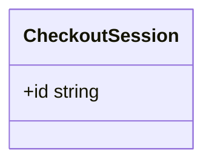

# {{title}}

{{description}}

# Types

Node IDs are source identifiers, not translations.

# Diagram

```mermaid
classDiagram
  class CheckoutSession {
    +id string
  }
```

# Notes for consumers
